# 🅿️ ParkProof

[](https://github.com/melroyds/parkproof/actions/workflows/test.yml)
[](LICENSE)

> Photograph any Australian parking sign → get a plain-English answer to **"Can I park here right now?"** plus a timestamped, GPS-tagged evidence record in case you get a wrongful ticket.

A mobile-first, installable PWA with end-to-end AI: sign translation, evidence capture, departure reminders, and a court-friendly PDF export — all working against a real AWS backend.

> **🚀 Try it live:** [https://www.parkproof.com.au](https://www.parkproof.com.au)
>
> Best on a phone — tap your browser's share menu → **"Add to Home Screen"** and ParkProof installs like a native app (own icon, fullscreen, no browser chrome). Also works fine on desktop if you upload sign photos from your library.

---

## Demo

When you're actively parked, the home screen becomes the countdown — open the app, see how much time you have left.

<p align="center">
  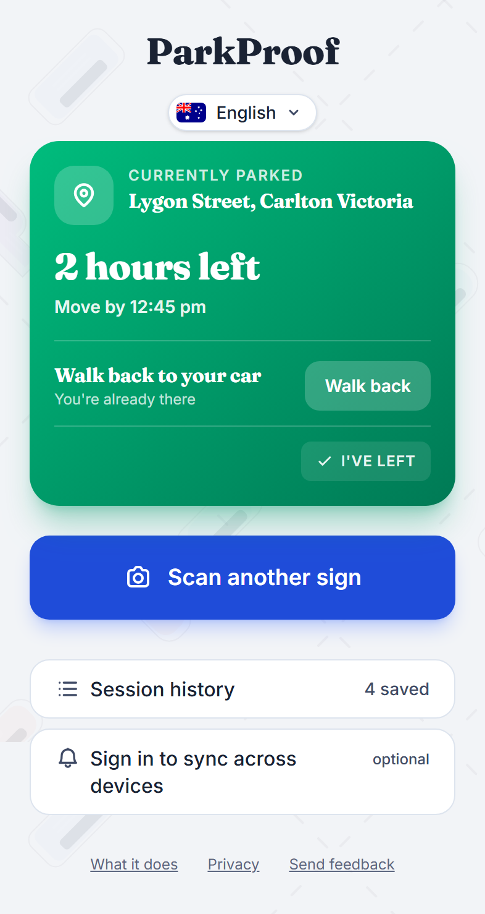
</p>

### Core flow

The seven-step path from photographing a sign to having court-ready evidence.

| 1. Scan | 2. Clarify (when needed) | 3. Result |
|---|---|---|
| 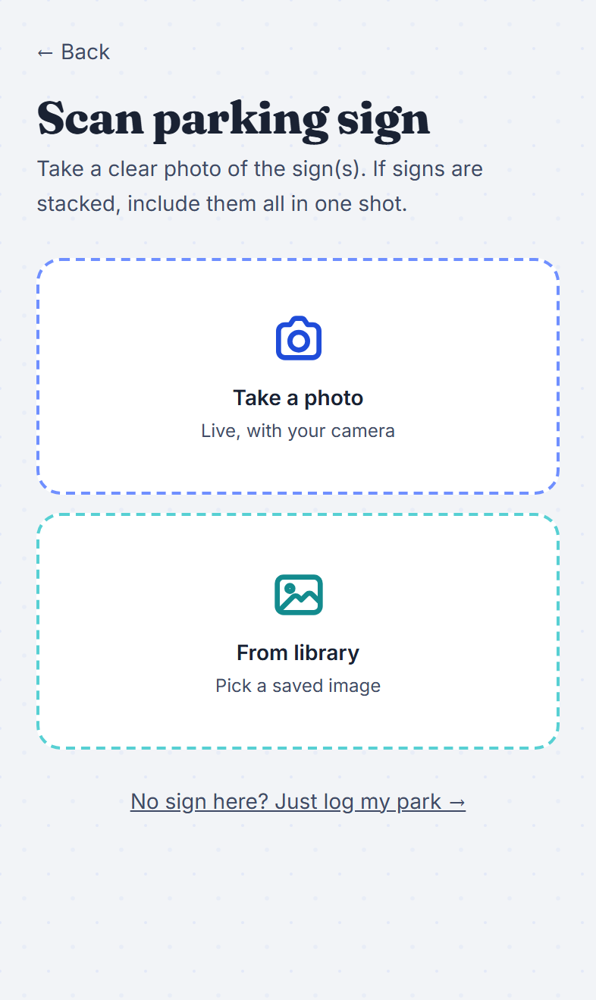 | 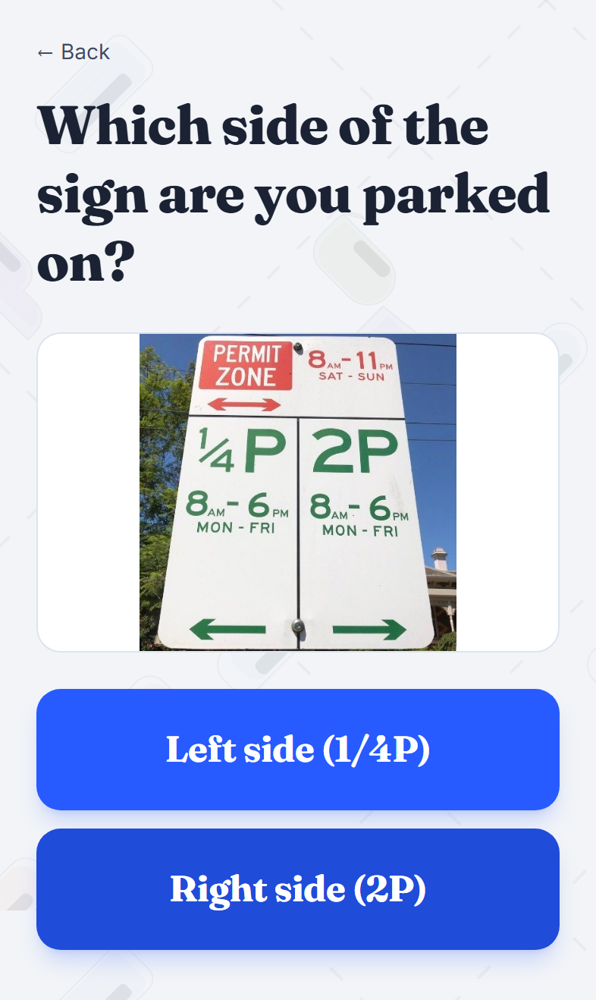 | 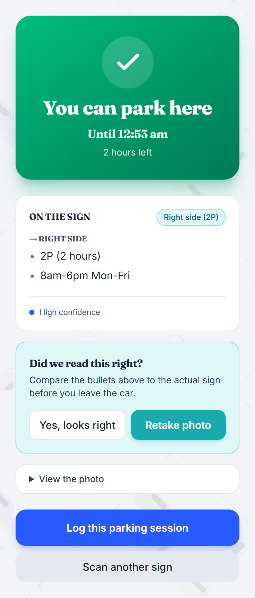 |

| 4. Log session | 5. Reminder | 6. History |
|---|---|---|
| 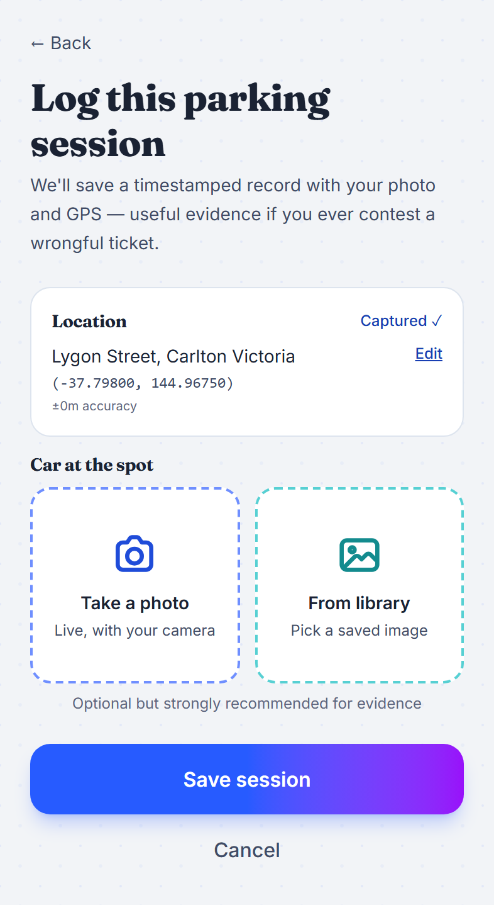 | 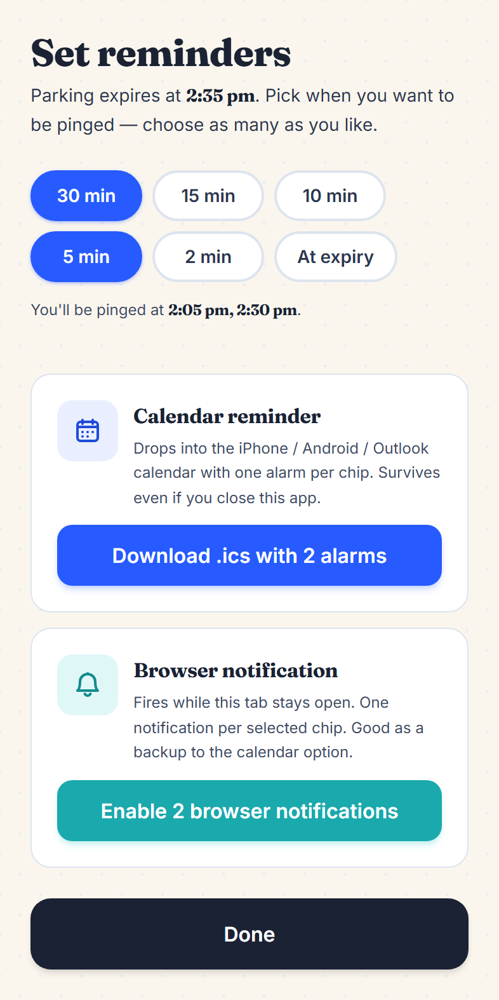 | 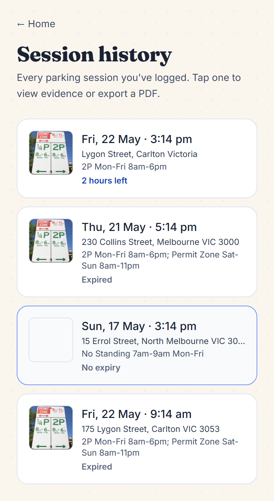 |

| 7. Session detail · PDF export · evidence appendix |
|---|
| 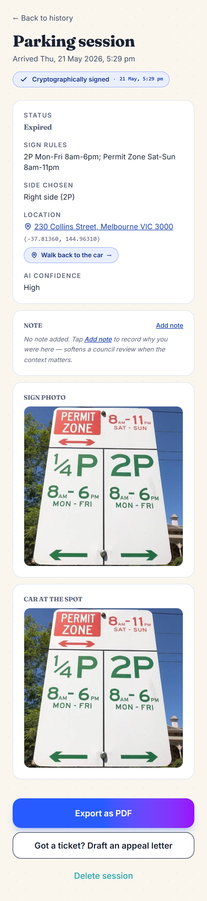 |

### Smart features

The things you don't expect from a parking app: a pre-flight quality check on your photo before any Claude token is spent, a proximity-matched "you scanned this spot before" card that re-uses the prior reading, and an AI-drafted appeal letter that cross-references your saved evidence.

| Photo-quality warning | Smart re-scan card |
|---|---|
| 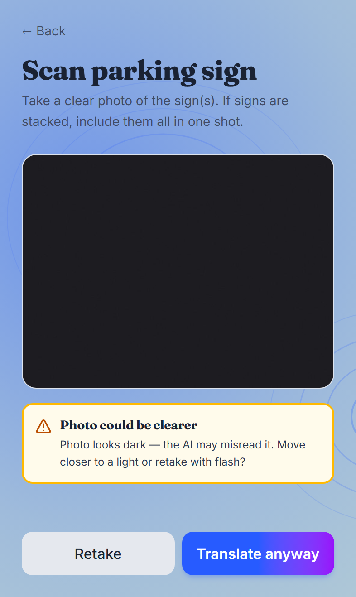 | 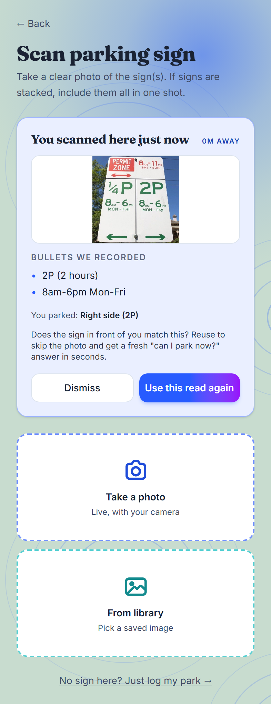 |

| AI-drafted appeal letter |
|---|
| 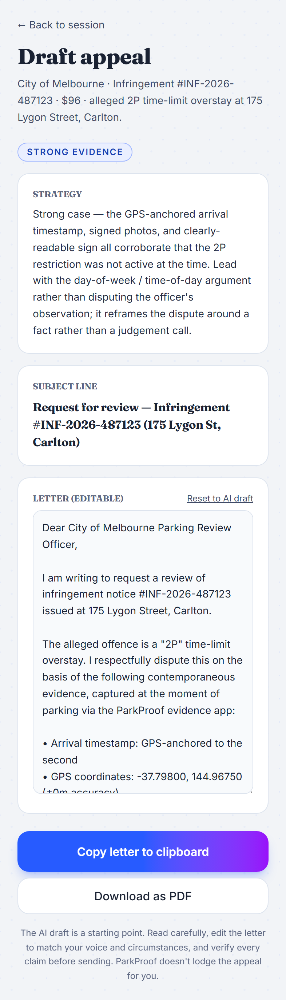 |

### Auth & cloud sync (opt-in)

Sign-in is never required — the app works fully anonymous. When you do choose to sign in (email + password, or Apple / Google federation via Cognito Hosted UI), sessions opportunistically mirror to DynamoDB and photos to a private per-user S3 prefix.

| Sign in (Apple / Google / email) | Account settings |
|---|---|
| 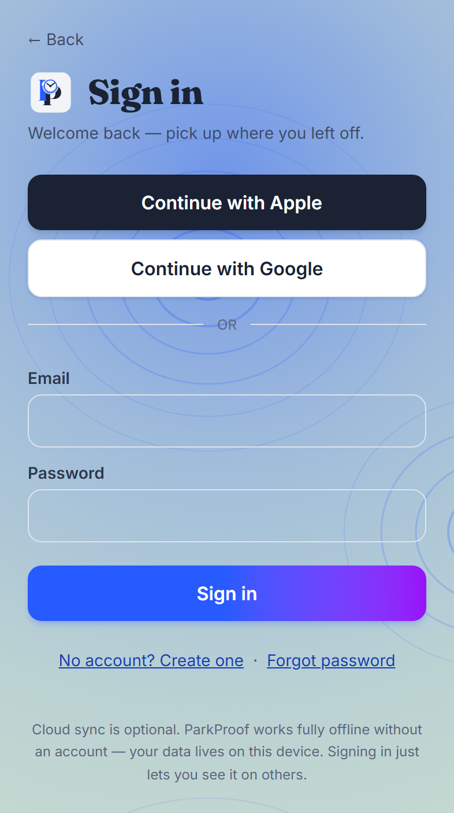 | 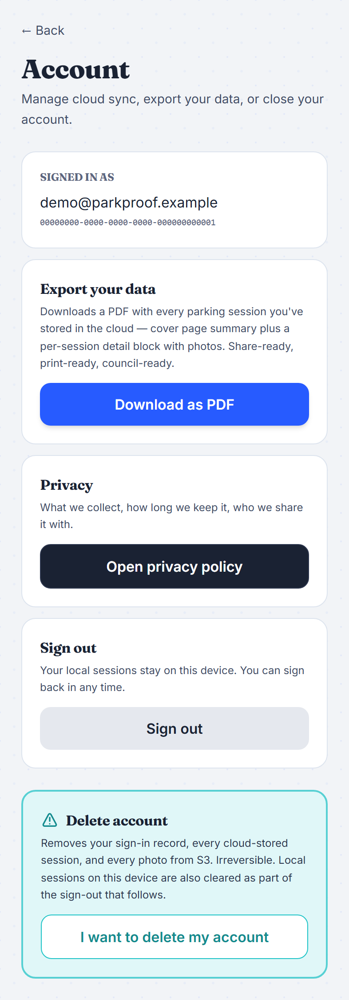 |

### Multilingual UI — 7 languages

Language list chosen from the top non-English languages spoken in the **City of Melbourne LGA** (2021 ABS Census). Same home screen in three of the seven scripts:

| 🇦🇺 English | 🇮🇹 Italiano | 🇮🇳 हिन्दी |
|---|---|---|
| 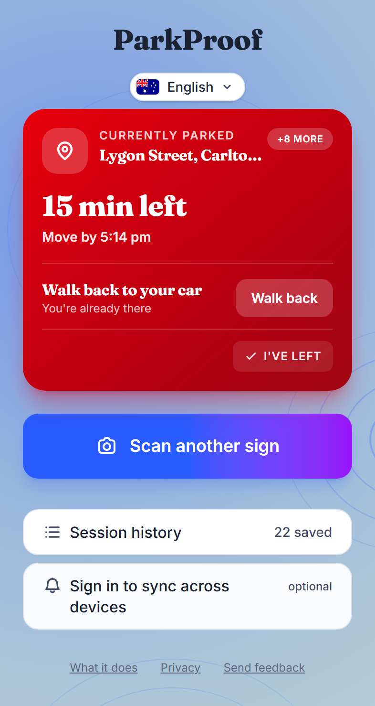 | 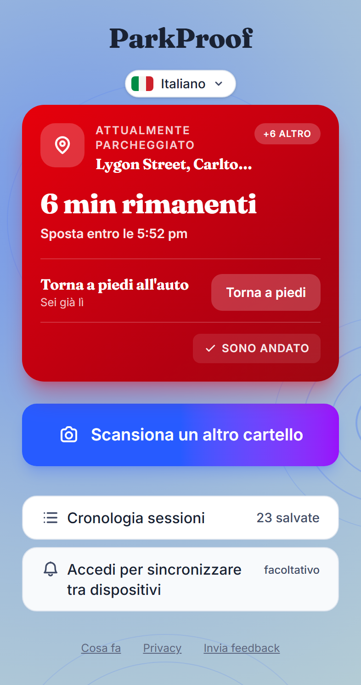 | 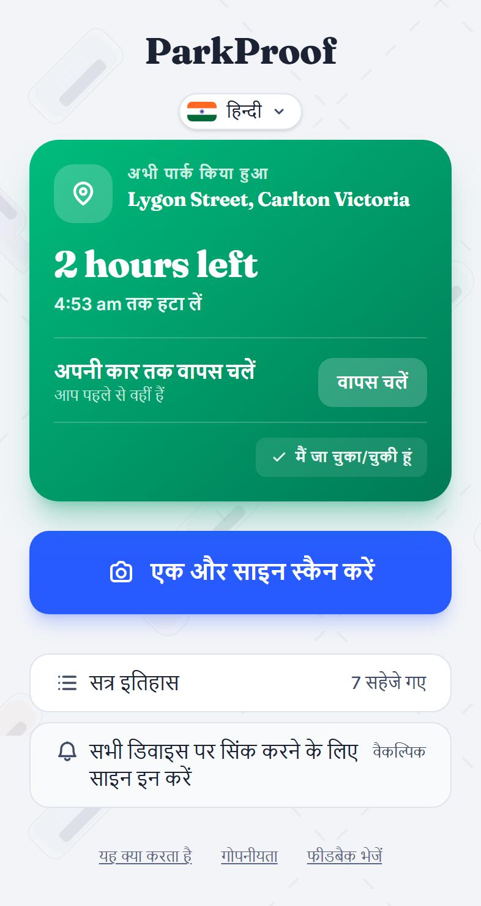 |

> _All 16 screenshots are auto-generated by `npm run screenshots` — a Playwright harness in [`scripts/screenshots.mjs`](scripts/screenshots.mjs) drives the real app on an iPhone-15-Pro viewport with mocked Anthropic + AWS calls, so the run is hermetic and offline. Re-run after any UI change and the demo grid updates._

---

## What it does

### Core flow
1. **Sign Translator.** Camera-or-library photo → Claude vision reads the sign → plain-English **"can I park now?"** answer in ~8–12 seconds, with the exact moment by which you must leave.
2. **Photo-quality pre-check.** Before firing the Claude call, a canvas-based pre-flight runs Laplacian-variance blur detection and Rec.709 luminance checks. If the photo is blurry, too dark, or blown out, the user sees a friendly warning *before* spending a token. Informs, doesn't block — they can override.
3. **Clarify step.** When the model detects position-dependent rules (different arrows, side-specific bays, EV-only spots), it surfaces a chooser before answering, so the time-math matches your actual spot.
4. **Restriction-transition heads-up.** When a meaningful rule change is approaching within ~3 hours (e.g. "Permit Zone ends — anyone can park free until 8am"), a brand-blue banner appears under the answer card. Helps the user decide *should I park now or wait five minutes*.
5. **Session Logger.** Capture the moment of parking: GPS coords + reverse-geocoded street address (editable if wrong) + optional car photo. Saved to the device's local storage.
6. **Multi-reminder picker.** Pick any combination of 30 / 15 / 10 / 5 / 2 / 0 minutes before expiry. One `.ics` event with multiple `VALARM` blocks (honoured natively on macOS, iOS, and Google Calendar) AND one in-tab browser notification per selected offset. Past offsets are line-through and auto-disabled as the clock ticks.
7. **Live "Currently parked" home.** When at least one session is still in the future, the home screen swaps its hero illustration for a live countdown card colour-coded by urgency (green > 1h, amber 15–60min, red <15min). One tap takes you into the evidence record. **No-sign sessions** (logged at unsigned spots — see #14) stay on the card with elapsed-time ("Parked for 2h 14m") and a "No posted restrictions" caption; the driver ends them explicitly via the inline **"I've left"** button, which stamps an `ended_at` timestamp on the evidence record and removes the card from home. The same end-session affordance is available in any session's detail screen, useful for **leaving an expiry-bearing session early** so the PDF reflects actual time on-site instead of the sign's posted limit.
8. **Walk-back navigation.** The active-session card shows distance + estimated walking time to your car, plus a "Walk back →" button that deep-links straight into Apple Maps (iOS) or Google Maps (everywhere else) with walking mode forced.
9. **Evidence Export.** Multi-page PDF with arrival time in the parker's local timezone, address, GPS, ParkProof Guidance one-liner, sign photo, the user's optional note, and car photo with **address + timestamp burnt into the bottom corner** as caption overlay. Optional signature appendix when the session was cryptographically signed (see below).
10. **Cryptographic evidence signing.** After each session is saved, the photos are SHA-256 hashed in-browser and the canonical metadata is signed by an **AWS KMS ECDSA P-256** key. The signature appendix in the PDF includes the raw bytes plus a one-paragraph `openssl dgst -verify` walkthrough so a council, court, or insurer can verify the evidence chain without ParkProof being in the loop.
11. **Driver's note.** A 280-character free-text field on each session for the *why* — "Mum's chemo at the Royal", "Saturday market". Renders verbatim in the evidence PDF. Softens a council review when context matters.
12. **AI-drafted appeal letter.** If you do get a ticket, photograph it → Claude reads the notice, cross-references your saved evidence, and drafts a formal letter to the issuing council with an evidence-strength rating (strong / moderate / weak) and a one-paragraph strategy note. Editable; export as a separate PDF.
13. **Session History.** Every saved parking session, with status (active / ended / expired) and the option to re-export the PDF, draft an appeal, or delete.
14. **No-sign mode.** Sometimes the closest pole is meaningless — a quiet residential street, an open carpark, an apartment laneway with no posted restriction. The "No sign here? Just log my park →" entry on the scan screen captures an *ambient surroundings* photo plus the same GPS + reverse-geocode evidence chain, skipping the AI translation entirely. These sessions are **open-ended**: they stay on the home "Currently parked" card with elapsed-time copy until the driver hits **"I've left"**, at which point an `ended_at` stamp lands on the record and the actual duration is computed into the evidence PDF (`Actual duration: 2h 14m`). Defensible evidence that you parked *here* during *this window* even when the council later puts up a sign.

### Smart features
- **Smart Re-scan.** When you arrive at a spot you've scanned before (within 40m and 7 days), ParkProof recognises it and offers to **reuse the prior reading** — no photo, just refresh the current-time answer. ~3× faster and ~4× cheaper per scan. Desktop and no-GPS users get a "Reuse a recent scan" picker instead.
- **Timezone-aware everywhere.** Every displayed time — result, reminder, history, PDF, calendar event — is rendered in the *parking spot's* timezone (resolved from GPS via `tz-lookup`), not the user's device locale. Scan in Sydney while travelling, see Sydney times.
- **Date-aware time labels.** Times more than 24 hours away show the day + numeric date ("Until 10:00 am, Mon 18/05/2026") so a long-window expiry never looks like a today-window expiry.
- **Photo-resize.** Photos are downscaled to ≤1200px and re-encoded as 0.82-quality JPEG before they touch state — keeps localStorage under quota, makes API payloads small, lowers per-scan cost.
- **Quota auto-recovery.** When `localStorage` hits its ~5MB ceiling, a 3-phase reclamation runs against expired sessions only (strip car photo, then sign photo, then evict whole session) before anything fails. Active sessions are never touched.
- **Background signing retry.** If the tab closes mid-signing, the next app load sweeps for unsigned sessions and re-attempts (5-minute throttle, 3-attempt cap, 30-day horizon). Sessions self-heal.
- **Stepped loading UX.** While the model thinks, the loading screen progresses through "Reading the sign… Identifying parking rules… Computing when you can park… Composing the answer…" with a real progress bar. Timings tuned from actual CloudWatch latency data.
- **AI feedback loop (Layers 1 + 2).** After each result, "Yes, looks right" or "Retake photo" fires a structured event to CloudWatch with the model's confidence, the rules-shape, whether clarification fired, the local hour, and a 120-char rules excerpt. Lets you slice failure modes in Logs Insights — *"of all retake verdicts, what's the confidence distribution? Which sign patterns? Which hours-of-day?"* — without any PII. Verdict counts (Layer 1) tell you *whether* there's a problem; Layer 2's context tells you *which kind*.
- **Multi-lingual UI — 7 languages.** Language picker on the home screen swaps the entire interface between 🇦🇺 English (default), 🇨🇳 简体中文, 🇻🇳 Tiếng Việt, 🇮🇹 Italiano, 🇬🇷 Ελληνικά, 🇮🇳 हिन्दी, and 🇮🇳 ਪੰਜਾਬੀ. Language list chosen from the top non-English languages spoken in the **City of Melbourne LGA** (2021 ABS Census). Powered by `react-i18next` with browser-language auto-detection + localStorage persistence. The Claude AI's sign-translation output stays in English (it reflects what's literally on the sign); the entire UI scaffolding around it — including the evidence PDF — translates.

### Opt-in cloud
- **Sign-in is optional**, never gated. Every feature works fully anonymous. If you choose to sign in (email + password, or Apple / Google federation via Cognito Hosted UI), every saved session opportunistically mirrors to DynamoDB, and photos go into a private per-user prefix in an S3 evidence bucket via short-TTL presigned `PUT` URLs. Local storage stays the source of truth; cloud is durability + cross-device recovery for evidence that might be needed weeks after the fact.
- **Account export.** One tap exports a complete PDF dump of every session you've saved — handy for legal hand-off or just walking away with your own data.
- **Account delete.** Wipes everything: DynamoDB rows, S3 photos under your prefix, the Cognito user record itself. No retention, no soft-delete, no "we kept a copy for analytics."

### PWA
Installable to the iPhone / Android home screen with a real app icon, theme colour, splash screen, and offline-capable service worker. Main bundle ~225KB gzipped (~750KB raw) — heavier libraries (jsPDF, ics, html2canvas, DOMPurify) are lazy-loaded only when used; UI locale strings are bundled inline so the language picker is instant.

---

## The problem

Australian parking signs are notoriously dense — especially in inner-city Melbourne, Sydney and Brisbane. A typical pole stacks 3–4 signs with overlapping time windows, side-specific arrows, permit-zone overlays, and ticket-machine bays. Existing apps (ParkingMate.ai, Parky.AI, SIGNlanguage) translate the rules — none give you the **evidence trail** you'd need to dispute a ticket later: timestamp, GPS, car-at-the-spot photo. ParkProof does both.

---

## Architecture

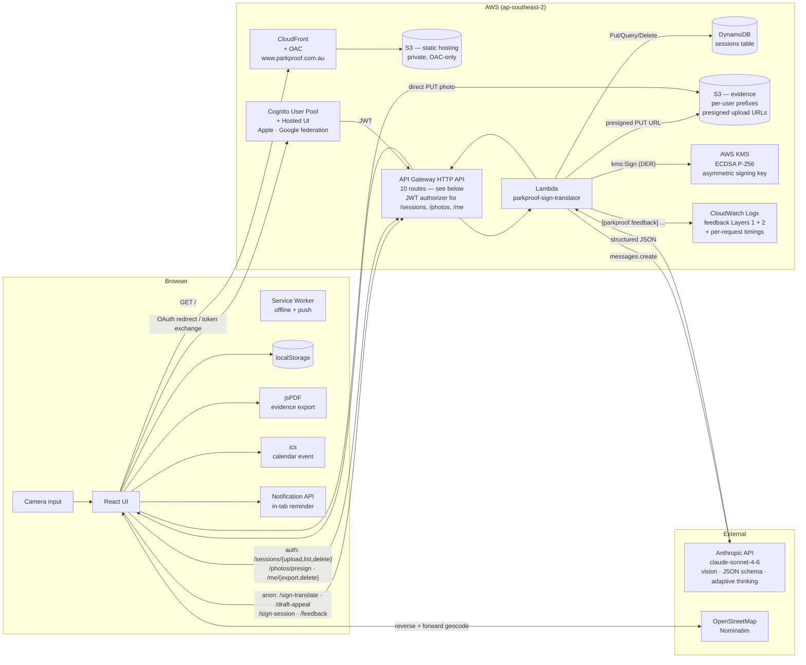

A single Lambda handler ([`lambda/index.js`](lambda/index.js)) is **reused as the local dev proxy** via a small Vite plugin in [`vite.config.ts`](vite.config.ts). One handler, two runtimes — no mocks during dev, no surprise differences on deploy. The handler dispatches by path across ten routes — four anonymous (`/sign-translate`, `/draft-appeal`, `/sign-session`, `/feedback`) and six JWT-authenticated (`/sessions/upload`, `/sessions/list`, `/sessions/delete`, `/photos/presign`, `/me/export`, `/me/delete`). Auth-required routes go through API Gateway's Cognito JWT authorizer before the Lambda ever runs. All ten routes share one Lambda function and one cold-start budget.

---

## Stack

| Layer | Choice | Why |
|---|---|---|
| UI | Vite + React 19 + TypeScript | Fast HMR, type safety, modern ergonomics |
| Styling | Tailwind CSS 4 (Vite plugin) | One-utility-class-per-thing keeps the JSX legible |
| Brand | Fraunces (display) + Inter (body), blue/navy/teal palette | Modern + civic, layered serif "P" + clock monogram |
| AI | Claude Sonnet 4.6 + adaptive thinking + `effort: low` | Multi-rule time-window reasoning needs adaptive thinking; `effort: low` keeps latency in the 6–12s range |
| Schema | `output_config.format: { json_schema }` | API-enforced JSON shape — no fragile regex parsing |
| Backend | AWS Lambda (prod) / Vite middleware (dev) | Same handler runs in both — what you debug locally is what runs in prod |
| Hosting | S3 (private) + CloudFront with Origin Access Control | HTTPS, global CDN, no public bucket |
| Storage (user data) | `localStorage` | No backend for user data needed at POC scale; sessions are user-private by design |
| Geocoding | OpenStreetMap Nominatim | Free, no key, in-browser; results cached per coord pair |
| Timezone | [`tz-lookup`](https://www.npmjs.com/package/tz-lookup) | Offline polygon library; ~200KB; resolves lat/lng → IANA timezone |
| Calendar | [`ics`](https://www.npmjs.com/package/ics) | RFC 5545 compliant `.ics` with `GEO` field; lazy-loaded |
| PDF | [`jsPDF`](https://www.npmjs.com/package/jspdf) + [`jspdf-autotable`](https://www.npmjs.com/package/jspdf-autotable) | Multi-page evidence doc with embedded photos and a caption-overlay on the car photo; lazy-loaded |
| PWA | [`vite-plugin-pwa`](https://www.npmjs.com/package/vite-plugin-pwa) | Manifest + service worker + auto-generated icons in all sizes |
| i18n | [`react-i18next`](https://react.i18next.com/) + [`country-flag-icons`](https://www.npmjs.com/package/country-flag-icons) | Seven-locale support (EN-AU / zh-CN / VI / IT / EL / HI / PA), chosen from the top non-English languages spoken in the City of Melbourne LGA (2021 ABS Census). Browser-language auto-detection + localStorage persistence. SVG flag icons (not emoji) for consistent rendering. |
| Auth (opt-in) | AWS Cognito User Pools + [`amazon-cognito-identity-js`](https://www.npmjs.com/package/amazon-cognito-identity-js) | Email/password + federated **Google** + federated **Sign in with Apple** (hosted-UI redirect). Free below 50k MAU; in-bundle SDK, no Amplify. |
| Cloud sync (opt-in) | AWS DynamoDB (pay-per-request) + S3 (private, OAC) | Mirrors localStorage to the cloud when signed in; localStorage stays canonical. Photos go via presigned PUT URLs. |
| Telemetry | CloudWatch Logs Insights | Free at this scale; structured log events for feedback aggregation |

---

## Notable engineering decisions

- **One handler, two runtimes.** The Lambda function and the local dev proxy share the same `translateSign()` function. The Vite plugin dynamically imports `lambda/index.js` on each `/api/sign-translate` request — so what you debug locally is what runs in production.
- **API-enforced JSON, not prompted JSON.** The response shape is defined as a JSON Schema and passed via `output_config.format`. The model can't return malformed JSON or missing fields — eliminating an entire class of "the LLM forgot the rules field today" bugs. The schema covers nested per-variant clarifications too.
- **Adaptive thinking + `effort: low`.** Multi-rule parking-sign math (e.g. "compute the earliest leave-by across 1/4P-on-the-left, 2P-on-the-right, Permit-Zone-on-weekends") genuinely needs reasoning. We tried Haiku 4.5 (no thinking) to chase ~3s scans and it produced wrong "until" answers on stacked signs — so we reverted to Sonnet 4.6 with adaptive thinking, but lowered `effort` from `medium` to `low` to cut typical latency from 15–30s to 6–12s while keeping correctness.
- **Per-variant clarifications when signs are position-dependent.** When the model detects different rules per arrow / bay / side, it returns a `clarification: { question, options[] }`. The UI shows a chooser before the green/red card so the time-to-move calculation matches the user's actual spot.
- **Grouped observations.** The "On the sign" panel renders `observations: { scope, items[] }[]` — bullets grouped under headings like `→ Right arrow` or `↔ Both directions` — instead of a flat blob, mirroring how a human reads a sign.
- **Editable reverse geocode.** GPS → Nominatim → address shown next to coords. If the resolved address is wrong (or you parked just up the block), tap **Edit** and type a new one — forward-geocode swaps the coords and the rest of the pipeline (.ics, PDF, history) inherits the corrected location.
- **Smart re-scan with text-only refresh.** When the user lands within 40m of a recently-scanned spot (or picks one manually on desktop), ParkProof skips the vision call entirely and sends a text-only request: prior rules + current time → updated `can_park_now` + `until`. Same Sonnet model, same schema, but no image input → ~3× faster, ~4× cheaper. The frontend trusts the prior reading for everything except current-time fields.
- **Photo-resize before state.** Phone photos (3–8MB raw) are downscaled to ≤1200px @ 0.82 JPEG quality the moment they hit `handleFile()`. Originally added to fix a `localStorage` quota crash, but the same resize also shrinks the API payload and cuts per-scan Anthropic cost.
- **Timezone derived from coords.** The `until` time is computed in the user's actual local timezone, resolved from GPS via `tz-lookup`. Falls back to `Australia/Melbourne` when no coords are sent. Works correctly for anyone scanning anywhere — not just the home market.
- **Stepped loading state driven by real timings.** The 6–12s wait shows "Reading the sign… → Identifying parking rules… → Computing when you can park… → Composing the answer…" with a progress bar. Stages aren't real streaming (API Gateway HTTP API buffers responses), but the timing was tuned from CloudWatch latency data so it stays in sync with what the model is actually doing.
- **Anonymous-by-default, opt-in cloud.** Out of the box, no login, no email, no user accounts — localStorage holds the user's data on-device, the Lambda is stateless, and the privacy story stays trivial. Cross-device sync is available as an *opt-in upgrade*: sign in with email/password (or Apple/Google via federation, see [`docs/federation-setup.md`](docs/federation-setup.md)) and sessions mirror to a DynamoDB + S3 cloud store keyed to your Cognito user ID. localStorage stays the canonical source of truth even when signed in — the cloud is a mirror, not a replacement.
- **AI feedback loop.** "Yes, looks right" / "Retake photo" verdicts fire structured events to CloudWatch via `POST /feedback`. Logs Insights aggregates verdict counts and rates without a database — gives a real measured signal for prompt iteration. No PII captured (just verdict + random per-render UUID + timestamp).

---

## Running locally

```bash
# 1. Install
npm install

# 2. Add your Anthropic API key
echo "ANTHROPIC_API_KEY=sk-ant-..." > .env

# 3. Run
npm run dev
# → http://localhost:5173
```

You'll need a Claude API key from <https://console.anthropic.com/settings/keys>. Localhost is treated as a secure context, so geolocation, notifications, and the camera input all work without HTTPS.

> **Gotcha — if you're on Windows with [vestauth](https://www.vestauth.com/) installed**, it wraps `dotenv` and stops it from populating `process.env`. `vite.config.ts` works around this by assigning the parsed values explicitly — leave that bit alone or your `.env` will silently load to nowhere.

---

## Deploying

The deploy is fully automated by idempotent scripts in [`scripts/`](scripts/):

| Script | What it does | Frequency |
|---|---|---|
| [`scripts/deploy.sh`](scripts/deploy.sh) | Day-to-day deploy: rebuilds Lambda zip, updates function code + env (Cognito + DDB + S3 vars merged in), builds the frontend with prod API URL + Cognito IDs baked in, syncs `dist/` to S3, invalidates CloudFront. Ensures all 10 API routes exist on every run. | Every code change |
| [`scripts/harden.sh`](scripts/harden.sh) | One-time security pass: locks API Gateway CORS to the CloudFront origin (with `Authorization` + `GET` allowed for the auth routes), creates a CloudFront Origin Access Control, migrates the S3 origin from public website-endpoint to private REST-endpoint + OAC. | Once after initial deploy |
| [`scripts/setup-signing.sh`](scripts/setup-signing.sh) | One-time: creates a KMS asymmetric key (ECDSA P-256), attaches `kms:Sign` IAM policy to the Lambda role, exports the public key to `public/parkproof-public-key.pem`. | Once; re-run to rotate |
| [`scripts/setup-auth.sh`](scripts/setup-auth.sh) | One-time: creates the Cognito User Pool + App Client + hosted-UI domain + DynamoDB sessions table + S3 evidence bucket + JWT authorizer on API Gateway. Writes resource IDs to `scripts/.aws-resources` (gitignored) for `deploy.sh` to consume. | Once; re-run after IAM/scheme changes |
| [`scripts/set-throttle.sh`](scripts/set-throttle.sh) | Sets API Gateway request rate limits (default 20 burst / 10 rate per second). Bot protection without WAF cost. | Once; re-run to retune |
| [`scripts/billing-alarm.sh`](scripts/billing-alarm.sh) | Creates an AWS Budgets monthly alarm — emails you at 80% actual and 100% forecasted of a USD threshold. | Once; re-run with different threshold/email |
| [`scripts/smoke-test-auth.mjs`](scripts/smoke-test-auth.mjs) | End-to-end auth + cloud-sync test: throwaway sign-up → confirm → sign-in → upload session → list → presign photo → delete → nuke account. Asserts each step, cleans up on failure. | Run after any auth-touching change |
| [`scripts/screenshots.mjs`](scripts/screenshots.mjs) | Playwright harness — boots Vite, drives the app through every screen with mocked API calls, regenerates the README demo-grid PNGs. | After any visual change |
| [`scripts/teardown.sh`](scripts/teardown.sh) | Destroys every AWS resource the deploy created. Dry-run by default; pass `--confirm` to actually delete. Handles the CloudFront disable + wait + delete dance. | Only when walking away |

Stack: AWS Lambda (Node.js 20) + API Gateway HTTP API + S3 (private) + CloudFront. Hosted in `ap-southeast-2` (Sydney) — closest region to the primary use case.

**Prereqs:** AWS CLI configured with an IAM user that has admin (or scoped) permissions, `node`, plus PowerShell (Windows) or `zip` (everywhere else) on PATH.

---

## Optional cloud sync

ParkProof works fully without sign-in — that's the deliberate default. Open the app, scan a sign, log a session, get a reminder. Everything stays on the device.

If you sign in (Cognito-backed email/password, with hosted-UI hooks ready for Apple + Google federation — see [`docs/federation-setup.md`](docs/federation-setup.md)), the same sessions sync to **AWS DynamoDB** + **S3**, viewable from any device you sign into. Cloud writes are mirrored on save, deletes on delete; localStorage stays as the canonical source of truth.

Account management is in-app: **export your data** as a polished multi-page PDF (cover summary + per-session detail block with photos), **delete your account** to remove every DynamoDB row + S3 object + Cognito user record. Smoke-tested end-to-end via `npm run smoke-test:auth` — drives a throwaway account through sign-up → upload → list → presign → delete → account-nuke against the live API, asserting each step.

Anonymous-by-default, opt-in cloud — same code path either way. No login wall, no friction tax on first use.

## What's not built yet

- **True background push notifications** via the Web Push protocol. The current `.ics` calendar event covers the real "you'll be reminded even with the app closed" need. A proper Web Push pipeline would need a service worker push subscription, server-side scheduler (Lambda + EventBridge), and a session-store database — out of scope for the POC.
- **Citywide parking heatmap.** Every scan captures the raw data needed (translated rules + GPS) for a crowdsourced map of parking rules across Melbourne. Would be a genuine moat — council parking data is fragmented; nobody else has the AI-translation pipeline. The opt-in cloud-sync plumbing is now in place (DynamoDB + S3 + Cognito), but a heatmap also needs: (a) a "share my scans to improve the map" toggle distinct from the private cloud-sync sign-in, (b) the cold-start problem solved (a map with five scans is useless), (c) a Mapbox/Leaflet viewer. Build trigger: a few hundred consistent users *or* a council partnership offer.
- **Auto-submit infringement appeals.** The current flow drafts the letter and exports it as a PDF the user submits manually. Auto-submit would pre-fill a council's online dispute form with the session ID and a public PDF link — blocked by council-side captchas, login walls, and the absence of public APIs across Australian councils. Realistic version is deep-linking to the form with the metadata pre-encoded.
- **Voice confirmation.** "Hey ParkProof, when does parking expire?" — Web Speech API + simple intent matching, or an iOS Shortcut routing to a `parkproof://countdown` URL handler. ~half day. Limited by browser support in PWA-installed mode on iOS.
- **AI feedback Layer 3.** Layers 1 (verdict counts) and 2 (verdict + model context — confidence, sign-pattern, time-of-day) are both live. Layer 3 would add opt-in photo capture for systematic failures, building a private training dataset. Blocked on (a) the opt-in toggle UI, (b) an S3 bucket scoped to "failure samples only", (c) a privacy-policy line item. Sensible build trigger: Layer 2 surfaces a specific failure mode that's worth investing photo storage in.

---

## Files

```
ParkProof/
├── src/
│   ├── App.tsx                    ← view-state machine + home (active-session card, retry sweep)
│   ├── types.ts                   ← shared types: ParkingRules, ParkingSession, RuleVariant,
│   │                                Clarification, SignatureBundle, NextTransition, AppealDraft
│   ├── tz-lookup.d.ts             ← ambient module declaration
│   ├── index.css                  ← Tailwind v4 @theme tokens + body bg + cavalcade pattern
│   ├── components/
│   │   ├── ActiveSessionCard.tsx  ← live home countdown card with urgency colours + walk-back footer
│   │   ├── SignScanner.tsx        ← camera/library + silent GPS + reuse card + photo-quality pre-check
│   │   ├── Clarify.tsx            ← position chooser when the sign has arrows
│   │   ├── ParkingResult.tsx      ← green/red answer + transition banner + observations + verify + feedback
│   │   ├── SessionLogger.tsx      ← GPS + reverse-geocode + editable address + car photo
│   │   ├── ReminderOptions.tsx    ← multi-chip reminder picker + .ics + browser notification
│   │   ├── SessionHistory.tsx     ← list of saved sessions
│   │   ├── SessionDetail.tsx      ← single session + editable note + walk-back + PDF + appeal + delete
│   │   ├── AppealFlow.tsx         ← ticket photo capture → AI draft → editable letter → PDF
│   │   ├── AuthFlow.tsx           ← sign-in / sign-up / verify / forgot / reset, with Apple + Google
│   │   ├── AuthSettings.tsx       ← signed-in profile, PDF export, account deletion
│   │   ├── PrivacyPolicy.tsx      ← in-app plain-English privacy policy (uses <Trans> for inline tags)
│   │   ├── LanguageSelector.tsx   ← 7-language dropdown (Australian English + zh-CN + VI + IT + EL + HI + PA)
│   │   ├── ReuseCard.tsx          ← proximity-matched "scanned here recently" card
│   │   ├── RecentScansPicker.tsx  ← desktop / no-GPS fallback for smart re-scan
│   │   ├── BrandMark.tsx          ← inline SVG layered-P + clock logo
│   │   ├── Icon.tsx               ← 8-icon stroke set (currentColor)
│   │   └── LoadingProgress.tsx    ← stepped progress UI during the model call
│   ├── locales/                   ← seven-language UI translations (en, zh-CN, vi, it, el, hi, pa)
│   └── lib/
│       ├── claude.ts              ← translateSign + refreshInterpretation + draftAppeal
│       ├── feedback.ts            ← fire-and-forget verdict submission
│       ├── signing.ts             ← signSession (KMS) + retryUnsignedSessions (background sweep)
│       ├── storage.ts             ← localStorage CRUD + 3-phase quota auto-recovery
│       ├── sync.ts                ← localStorage ↔ cloud mirror (upload, list, delete, export)
│       ├── auth.ts                ← amazon-cognito-identity-js wrapper (sign-in / up / verify / reset)
│       ├── auth-context.tsx       ← AuthProvider — reads Cognito session into React state
│       ├── auth-context-shape.ts  ← Context type + createContext (split to satisfy react-refresh)
│       ├── use-auth.ts            ← useAuth hook
│       ├── federated-auth.ts      ← hosted-UI redirect + callback handler (Apple / Google)
│       ├── i18n.ts                ← react-i18next init + 7-language resource registry
│       ├── geocode.ts             ← Nominatim reverse + forward
│       ├── geo.ts                 ← Haversine distance
│       ├── walk-back.ts           ← walking ETA + maps deep-link routing (Apple / Google)
│       ├── photo-quality.ts       ← canvas-based blur + brightness pre-flight
│       ├── image.ts               ← canvas-based resize + JPEG re-encode
│       ├── ics.ts                 ← calendar event generator (multi-VALARM)
│       ├── notifications.ts       ← Notification API multi-offset scheduler
│       ├── pdf.ts                 ← evidence PDF + appeal PDF + account-export PDF (signature appendix)
│       ├── time-format.ts         ← relative + date-aware absolute time helpers (+ localized variants)
│       ├── timezone.ts            ← sessionTimezone + timezoneForCoords (tz-lookup wrapper)
│       ├── accuracy.ts            ← GPS-accuracy formatting + usability thresholds
│       ├── countdown.ts           ← time-until-expiry → urgency level + label (+ localized variant)
│       └── use-now.ts             ← interval-tick hook for live countdowns
├── lambda/
│   ├── index.js                   ← path dispatcher: translateSign + draftAppeal + signSession + feedback + cloud-sync routes
│   ├── cloud-sync.js              ← sessions/upload, sessions/list, sessions/delete, photos/presign, me/export, me/delete
│   ├── index.d.ts                 ← types for the local-dev import
│   └── package.json               ← deploy-zip deps (@anthropic-ai/sdk, @aws-sdk/* DDB / S3 / KMS / Cognito, tz-lookup)
├── public/
│   ├── parkproof-icon.svg         ← layered-P + clock app icon
│   ├── parkproof-wordmark.svg     ← horizontal logo lockup
│   ├── parkproof-icon-mono.svg    ← single-colour variant
│   ├── parkproof-splash.svg       ← portrait splash for PWA install
│   ├── hero-illustration.svg      ← home-screen scene
│   ├── empty-history.svg          ← parking-bay empty state
│   ├── cavalcade-pattern.svg      ← repeating background of stylised cars
│   ├── og-image.png               ← social share card (1200×630)
│   ├── parkproof-public-key.pem   ← KMS public key for openssl verification of signatures
│   ├── icons/                     ← 8 stroke icons (camera, gallery, calendar, bell, list, pin, check, warning)
│   └── pwa-*.png                  ← auto-generated PWA install icons (gitignored)
├── archive/old-melbourne-civic/   ← archived first-round assets (Melbourne Civic direction)
├── docs/
│   ├── asset-brief.md             ← historical brief for asset generation
│   ├── federation-setup.md        ← step-by-step for wiring Apple + Google OAuth into Cognito
│   └── screenshots/               ← README demo-grid PNGs, regenerated by npm run screenshots
├── scripts/
│   ├── deploy.sh                  ← day-to-day deploy
│   ├── harden.sh                  ← one-time security pass
│   ├── set-throttle.sh            ← API rate limits
│   ├── billing-alarm.sh           ← AWS Budgets alarm
│   ├── setup-signing.sh           ← one-time: create KMS key, attach IAM policy, export public key
│   ├── setup-auth.sh              ← one-time: Cognito User Pool + DynamoDB table + S3 evidence bucket + JWT authorizer
│   ├── smoke-test-auth.mjs        ← end-to-end test: sign-up → upload → list → delete via live API
│   ├── screenshots.mjs            ← Playwright harness — drives the app, regenerates demo PNGs
│   ├── screenshots-fixtures/      ← inputs consumed by the screenshot harness
│   └── teardown.sh                ← destroy everything (dry-run by default)
├── vite.config.ts                 ← API middleware (all 10 routes) + .env loader + Node-global polyfills + PWA
├── parkproof-spec.md              ← PM-style product brief (problem, scope, success metrics)
├── CLAUDE.md                      ← engineering notes for future AI sessions
└── README.md                      ← this file
```

---

## Further reading

- [`docs/features.md`](docs/features.md) — **canonical feature showcase**: every cool thing ParkProof does, grouped thematically, with copy-paste-ready bullets for Reddit / LinkedIn / interview use
- [`docs/case-study.md`](docs/case-study.md) — PM-craft narrative: how the project was scoped, sequenced, and traded off
- [`docs/parkproof-build-journal.pdf`](docs/parkproof-build-journal.pdf) — chronological build journal with decision-tree branches at every pivot (6 days, 50+ commits, the failed architectures preserved)
- [`docs/how-parkproof-was-built.pdf`](docs/how-parkproof-was-built.pdf) — ELI15 explainer of the stack + architecture
- [`docs/lessons-for-next-project.md`](docs/lessons-for-next-project.md) — portable takeaways: what to do (and not do) on the next portfolio project, distilled from ParkProof

## Credits

Built with [Claude Code](https://claude.com/claude-code). Spec by Melroy D'Souza.
